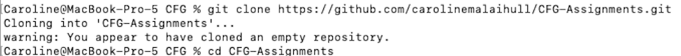
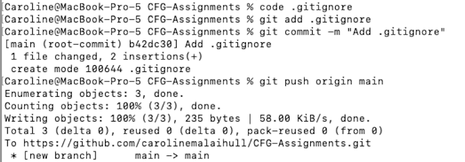
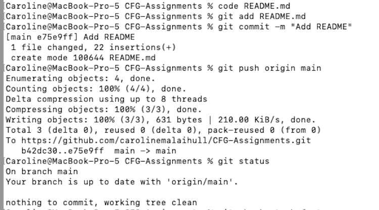
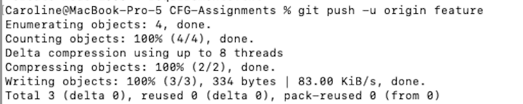
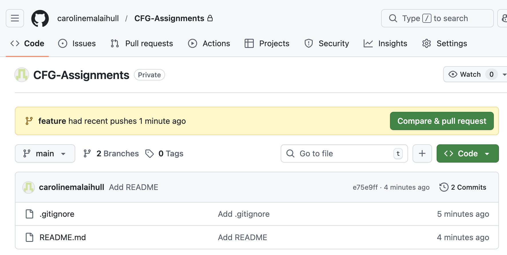
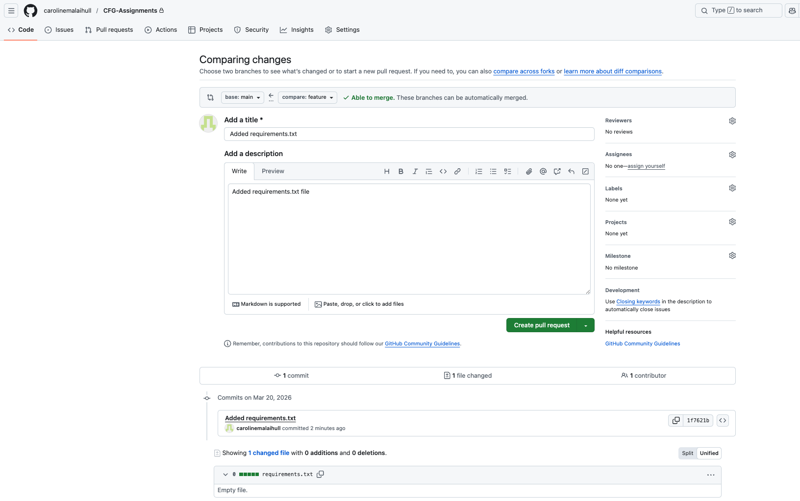
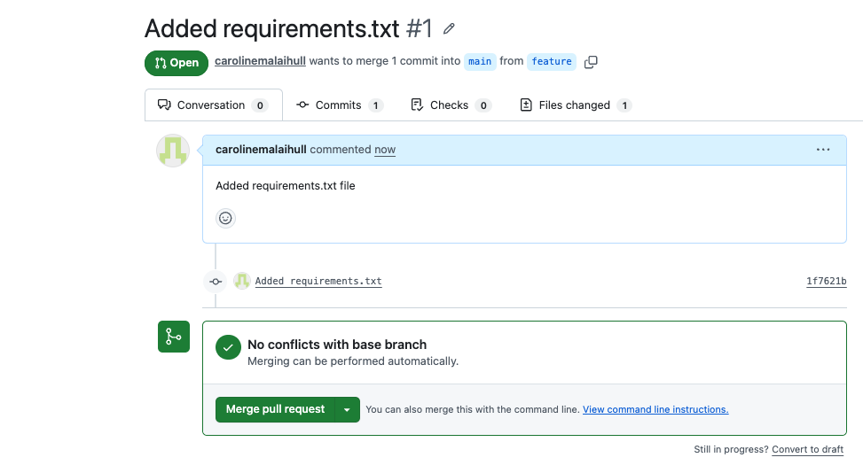
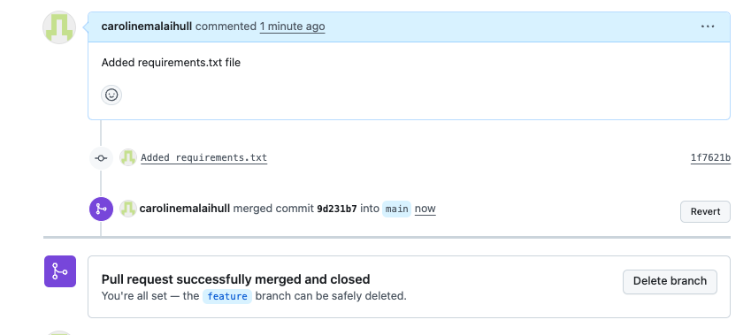
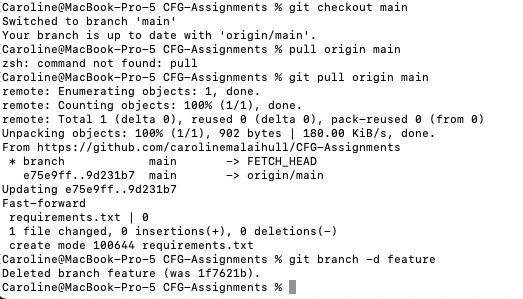

# Caroline Hull

### README
 
## Bio

**I work in biotech and I am just starting my data science journey. I would love to learn how to combine biology with data science to get the most from my experimental work.**

## Experience to date
Python *(beginner)*
R *(beginner)*

## Current Assignment

In this assignment I will demonstrate Git and GitHub usage for collaborative projects using different Git commands

## Git Commands

Use `git status` to list all new or modified files that haven't yet been committed.
Use `git checkout -b feature` to create a branch from the main branch and switch to it.
Use `code` to create a new file.
Use `git add` to stage new changes.
Use `git commit -m "Comment"` to commit new changes to the local branch.
Use `git push -u origin feature` to push changes from the local branch for example called feature to the remote branch.

### Example Git Workflow 

git status

git checkout -b feature

code

git add .

git commit -m "Add assignment work"

git push -u origin feature

### Summary of process

1. Change directory to repository

2. Clone repository from github

3. Create .gitignore and push to remote repo using git add, git commit and git push

4. Create README file and push to remote repo

5. Create a new branch called "feature" and switch to it

7. Create requirements file on feature branch

6. Check branch status

7. Push changes on feature branch to remote branch 

8. Find pull request on github repository

9. Open pull request on github repository

10. Check for conflicts on github repository

11. Merge with base branch

12. Image directory created here

